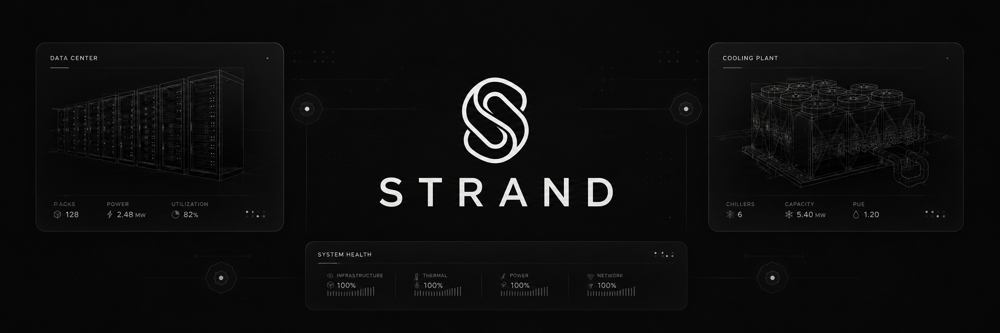

<p align="center">
  
</p>

<p align="center">
  
  
  
  
  
</p>

<p align="center">
  <a href="https://strand-iota.vercel.app/">🌐 Live Demo</a> ·
  <a href="https://strand-87qa.onrender.com/docs">⚡ API Docs</a> ·
  <a href="ARCHITECTURE.md">🏗️ Architecture</a> ·
  <a href="CONTRIBUTING.md">🤝 Contributing</a>
</p>

---

## What is STRAND?

STRAND is an open-source multi-agent AI platform that automates specification compliance verification, risk contagion analysis, and mitigation planning for hyperscale data center, semiconductor fab, and large-scale infrastructure construction projects.

It solves a fundamental problem in the industry: **engineering specifications change. Vendor submittals arrive late, contain errors, and trigger cascading schedule failures.** STRAND catches these failures before they happen.

### Core Innovations

| Innovation | Description |
| :--- | :--- |
| **Spec-DNA Fingerprinting** | SHA-256 cryptographic hash chains from engineering clauses to vendor submittals — zero hallucination, citable sources for every compliance finding |
| **R₀ Contagion Engine** | Epidemiological $R_0$ adapted to model how a single component failure propagates schedule risk across the critical path |
| **AST Cypher Sandbox** | All LLM-generated Neo4j queries pass through an AST sanitizer that blocks mutations and enforces multi-tenant isolation |
| **Hybrid GraphRAG** | BM25 + Dense vector retrieval fused with Reciprocal Rank Fusion (RRF, k=60), enriched by 1-hop Neo4j BIM graph traversal |

---

## Quickstart

### Option 1 — Docker (Recommended)

```bash
git clone https://github.com/mithilgirish/Strand.git
cd Strand
cp backend/.env.example backend/.env    # Add your API keys
docker compose up
```

Open:
- **Dashboard**: http://localhost:3000
- **API Docs**: http://localhost:8000/docs
- **Neo4j Browser**: http://localhost:7474 *(neo4j / strand_local_dev)*

### Option 2 — Manual Setup

**Backend**
```bash
cd backend
python -m venv .venv && source .venv/bin/activate
pip install -r requirements.txt
cp .env.example .env                    # Add your API keys
uvicorn backend.main:app --reload --port 8000
```

**Frontend**
```bash
cd frontend
npm install
cp .env.example .env.local
npm run dev                             # http://localhost:3000
```

### Required API Keys

| Key | Where to Get It | Required |
| :--- | :--- | :--- |
| `GROQ_API_KEY` | [console.groq.com](https://console.groq.com) | ✅ Yes |
| `NEO4J_URI` + `NEO4J_PASSWORD` | [neo4j.com/cloud/aura](https://neo4j.com/cloud/aura/) (free tier) | ✅ Yes |
| `SUPABASE_URL` + `SUPABASE_SERVICE_ROLE_KEY` | [supabase.com](https://supabase.com) (free tier) | ✅ Yes |

---

## The 8-Agent Ensemble

| Agent | Responsibility |
| :--- | :--- |
| **Guardian** | PDF OCR ingestion, Spec-DNA compliance audit, R₀ calculation, RFI generation |
| **Scheduler** | Critical Path Method (CPM) simulation, delay probability forecasting |
| **Oracle** | Supply chain resiliency scoring, fallback vendor ranking, GeoJSON risk maps |
| **Brain** | Conversational Hybrid GraphRAG: BM25 + Dense + Neo4j 1-hop graph traversal |
| **Inspector** | Multimodal field voice NCR intake with offline-first edge resilience |
| **Planner** | Strategic mitigation synthesis with HITL approval workflow |
| **Judge** | Independent plan verification and compliance sign-off |
| **Dashboard** | Natural language → Cypher → live visual widget generation |

---

## Architecture

```
┌─────────────────────────────────────────────────────────────────┐
│       Next.js 16 Web Dashboard    │  React Native Expo App      │
└──────────────────────────┬──────────────────────────────────────┘
                           │ HTTPS / JWT
                           ▼
┌─────────────────────────────────────────────────────────────────┐
│      FastAPI Gateway · AST Cypher Sanitizer · Supabase JWKS     │
└────────────────┬─────────────────────────────┬──────────────────┘
                 │                             │
┌────────────────┴──────────┐    ┌─────────────┴────────────────┐
│  LangGraph Agent Ensemble  │    │    Persistence Layer         │
│  8 Agents · HITL Gate     │    │  Neo4j · ChromaDB · Redis    │
└───────────────────────────┘    └──────────────────────────────┘
```

See [ARCHITECTURE.md](ARCHITECTURE.md) for a deep technical breakdown.

---

## Technology Stack

| Layer | Technologies |
| :--- | :--- |
| **Web Frontend** | Next.js 16, TypeScript, Tailwind CSS, Recharts, React Grid Layout |
| **Mobile App** | React Native, Expo, AsyncStorage (offline-first) |
| **Backend API** | Python 3.11, FastAPI, Uvicorn, Pydantic v2 |
| **Agent Framework** | LangGraph, LangChain, Groq Llama-3.3-70B |
| **Graph Database** | Neo4j AuraDB (Community edition self-host compatible) |
| **Vector Database** | ChromaDB + rank_bm25 sparse BM25 + RRF fusion |
| **Auth & Security** | Supabase Auth, JWKS verification, multi-tenant RLS |
| **Cache & Queues** | Redis / fakeredis in-memory fallback |

---

## Project Structure

```
Strand/
├── backend/              # FastAPI + LangGraph 8-Agent Engine
│   ├── agents/           # Guardian, Brain, Scheduler, Oracle, Inspector, Planner, Judge, Dashboard
│   ├── routers/          # API route handlers
│   ├── vector/           # ChromaDB client & BM25 retriever
│   └── r0/               # R₀ contagion risk engine
├── frontend/             # Next.js 16 Command Dashboard
├── mobile/               # React Native Expo Offline App
├── docs/                 # Developer documentation
├── docker-compose.yml    # Single-command local stack
├── ARCHITECTURE.md       # Deep technical design docs
└── CONTRIBUTING.md       # How to add agents, parsers, and widgets
```

---

## Contributing

We welcome contributions of all kinds — new specification standard parsers, new agents, bug fixes, and documentation improvements. See [CONTRIBUTING.md](CONTRIBUTING.md) to get started.

---

## License

STRAND is open-source software licensed under the **[Apache License 2.0](LICENSE)**.

---

<p align="center">Maintained by the <strong>STRAND Open Source Community</strong></p>
