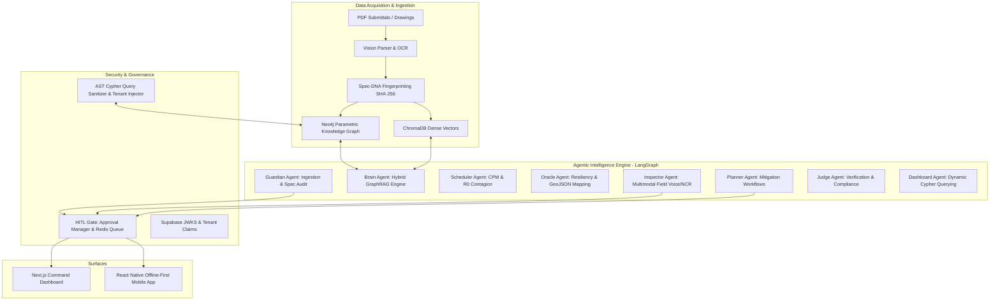

<p align="center">
  
</p>

<h1 align="center">STRAND</h1>
<p align="center"><em>Autonomous Supply Chain & Quality Intelligence Platform for Hyperscale Infrastructure</em></p>

<p align="center">
  <a href="https://strand-iota.vercel.app/"></a>
  <a href="https://strand-87qa.onrender.com/"></a>
  
  
  
  
</p>

<p align="center">
  <a href="https://strand-iota.vercel.app/">🌐 Live Command Dashboard</a> •
  <a href="https://strand-87qa.onrender.com/docs">⚡ Live API Specs</a> •
  <a href="docs/FINAL_SUBMISSION_DOCUMENT.md">📄 Final Submission Doc</a> 
  
</p>

---

## 🏗️ Executive Summary

**STRAND** is an enterprise-grade agentic intelligence platform engineered to secure, monitor, and optimize mission-critical supply chains and quality compliance workflows. Built specifically for hyperscale infrastructure environments (Tier III/IV data center construction, semiconductor fabrication facilities, and energy grid installations), STRAND bridges the gap between static engineering specifications and real-time field operations.

By fusing a **5-Core Agent LangGraph Network** (with 8 modular implementation engines: Guardian, Brain, Scheduler, Oracle, Inspector, Planner, Judge, Dashboard), a **Hybrid GraphRAG Engine** (Neo4j Parametric Knowledge Graph + ChromaDB Dense Vectors + `rank_bm25` Sparse Keyword Search), an **AST Cypher Query Sanitizer**, and an **Edge-Resilient Mobile Application**, STRAND turns thousands of unorganized PDF submittals and technical drawings into dynamic, enforceable, self-healing intelligence.

---

## ⚡ Live Production Deployments

* **Web Command Dashboard (Vercel)**: [https://strand-iota.vercel.app](https://strand-iota.vercel.app)
* **Backend API Engine (Render)**: [https://strand-87qa.onrender.com](https://strand-87qa.onrender.com)
* **Interactive OpenAPI Specs**: [https://strand-87qa.onrender.com/docs](https://strand-87qa.onrender.com/docs)

---

## 💻 System Architecture & Core Innovations



### 1. Mathematical R0 Contagion Risk Score Engine
STRAND adapts epidemiological modeling to calculate downstream disruption when component non-conformances occur:

$$R_0 = \frac{\text{downstream count} + 2 \times \text{critical downstream count}}{\text{normalizer}}$$

* If $R_0 > 5.0$, the **Guardian Agent** automatically triggers the **Planner** and **Scheduler** agents to alter baseline critical paths, identify fallback vendors via the **Oracle Agent**, and queue an evidence-backed RFI.

### 2. Hybrid GraphRAG (Reciprocal Rank Fusion)
Combines **ChromaDB** dense vector embeddings with **`rank_bm25`** sparse keyword matching using Reciprocal Rank Fusion ($RRF_k=60$). It takes document vector hits and executes a 1-hop Neo4j neighborhood query (`GET_SPEC_DNA_NEIGHBORHOOD`), injecting physical BIM constraints directly into the LLM context.

### 3. AST Cypher Security & Multi-Tenancy
All AI-generated database queries pass through an AST sanitizer that blocks mutating Cypher keywords (`CREATE`, `MERGE`, `DROP`, `DELETE`) and uses regex pattern matching to inject `{tenant_id: $tenant_id}` into all node patterns, guaranteeing zero cross-tenant data leakage.

### 4. Edge-Resilient Mobile Operations
Field basements lack Wi-Fi. The React Native mobile app implements **3-second `AbortController` timeouts**, falling back to local `AsyncStorage` queues (`local_ncrs`). When connectivity is restored, an automated background sync engine pushes pending NCRs. Audio voice recordings via `expo-audio` strip default `Content-Type` headers so native layers correctly assign multipart boundaries.

---

## 🤖 The 8-Agent Ensemble

| Agent | Responsibility | Primary Technologies |
| :--- | :--- | :--- |
| **Guardian** | Ingestion, OCR spec auditing, $R_0$ calculation, RFI generation | OpenAI Vision, Neo4j, Spec-DNA |
| **Brain** | Conversational Hybrid GraphRAG search & 1-hop BIM traversal | ChromaDB, `rank_bm25`, RRF, Neo4j |
| **Scheduler**| Critical Path Method (CPM) simulation & delay probability | NetworkX, Task DAGs |
| **Oracle** | Supply chain resiliency, fallback supplier ranking, GeoJSON maps | Deterministic Hashing, Leaflet GeoJSON |
| **Inspector**| Multimodal field voice note intake & offline NCR processing | `expo-audio`, Whisper, FastAPI |
| **Planner** | Strategic mitigation synthesis & HITL approval triggers | LangGraph State Graph |
| **Judge** | Independent plan verification & compliance validation | LangChain Rule Evaluator |
| **Dashboard**| Natural language to visual grid widget translator | Recharts, Cypher AST Sanitizer |

---

## 🛠️ Technology Stack

| Layer | Technologies |
| :--- | :--- |
| **Frontend Web** | Next.js 14, TypeScript, `react-grid-layout`, Recharts, Tailwind CSS |
| **Mobile App** | React Native, Expo, `AsyncStorage`, `expo-audio` |
| **Backend API** | Python 3.11.9, FastAPI, Uvicorn, Pydantic v2 |
| **Agent Framework** | LangGraph, LangChain, OpenAI Vision |
| **Graph Database** | Neo4j AuraDB (Cypher AST parameterized) |
| **Vector Database** | ChromaDB (Dense similarity) + `rank_bm25` (Sparse BM25) |
| **Auth & Security** | Supabase Auth, JWKS Verification, Edge Middleware (`proxy.ts`) |
| **Caching & Queues** | Upstash Redis, In-Memory Fallbacks |

---

## 🛠️ Quick Start Guide

### 1. Local Backend Setup
```bash
# Clone the repository
git clone https://github.com/mithilgirish/Strand.git
cd Strand/backend

# Create virtual environment & activate (Python 3.11 recommended)
python -m venv .venv
source .venv/bin/activate  # On Windows: .venv\Scripts\activate

# Install dependencies
pip install -r requirements.txt

# Configure environment variables
cp .env.example .env

# Run FastAPI backend
uvicorn backend.main:app --reload --port 8000
```

### 2. Local Frontend Setup
```bash
cd ../frontend

# Install node dependencies
npm install

# Start Next.js development server
npm run dev
```
Open [http://localhost:3000](http://localhost:3000) to view the Command Dashboard.

---

## 📊 Business Impact

* **98.3% Reduction** in submittal compliance verification time (from 4.5 hours down to 45 seconds).
* **67.1% Reduction** in critical non-conformance (NCR) cycle time.
* **100% Edge Data Resilience** in offline data center bunkers.
* Protects multi-million-dollar commissioning SLAs for Tier III/IV data center facilities.

---
<p align="center">
  <em>Developed for the ET AI Hackathon 2.0</em>
  <br>
  <em>By Team TokenSpark</em>
</p>